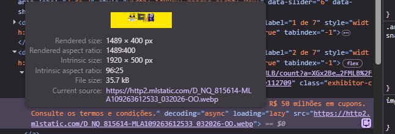

# Imagens 

Em aplicações web, imagens são um dos principais fatores que impactam negativamente a performance. Esse tipo de recurso costuma ser mais pesado tanto para o carregamento (transferência entre servidor e navegador) quanto para o processamento e renderização no browser.

Ao utilizar ferramentas de análise de performance, é comum identificar imagens como um dos maiores responsáveis pelo aumento no tempo de carregamento da aplicação, especialmente quando não estão otimizadas.

Em projetos Angular, também precisamos nos preocupar com performance, tanto no carregamento inicial (initial load) quanto durante o tempo de execução da aplicação (runtime).

Para isso, existem diversas técnicas que ajudam a otimizar o uso de imagens em projetos frontend, reduzindo o tempo de carregamento e melhorando a experiência do usuário.

## Formato de imagens

Grande parte das aplicações web ainda utiliza formatos tradicionais como PNG e JPEG, que possuem ampla compatibilidade, mas não são os mais eficientes em termos de performance.

O JPEG é ideal para fotos, pois utiliza compressão com perdas, reduzindo o tamanho do arquivo. Já o PNG é mais indicado para imagens que exigem transparência ou alta fidelidade, porém tende a gerar arquivos maiores.

Formatos modernos como WebP e AVIF oferecem melhor compressão e qualidade, sendo mais eficientes para a web atual.

A mesma imagem pode ter tamanhos bem diferentes dependendo do formato utilizado:

PNG: 1.2 MB
JPEG: 500 KB
WebP: 320 KB
AVIF: 220 KB

Mesmo mantendo uma qualidade visual semelhante, formatos modernos como WebP e AVIF conseguem reduzir significativamente o tamanho do arquivo.

Isso impacta diretamente:

Tempo de carregamento
Consumo de banda
Performance geral da aplicação

#### Case de mercado



Nessa imagem, podemos verificar que se trata de uma imagem grande, utilizada no banner principal da página porém no formarto moderno webp, a mesma imagem em png e 
Nesta imagem, podemos observar o uso de um banner de grandes dimensões na página principal. Apesar do tamanho, a imagem está no formato moderno WebP, que oferece melhor compressão e qualidade quando comparado a formatos tradicionais como PNG e JPEG.

Essa escolha impacta diretamente métricas de performance, especialmente o Largest Contentful Paint (LCP) — que mede o tempo de carregamento do maior elemento visível na tela (geralmente banners como este).

#### 📊 Comparativo estimado de impacto no LCP (webvitals)

| Formato | Tamanho estimado | Tempo de carregamento (3G) | Impacto no LCP |
| ------- | ---------------- | -------------------------- | -------------- |
| PNG     | ~1.8 MB          | ~3.0s – 4.5s               | Alto (ruim)    |
| JPEG    | ~900 KB          | ~2.0s – 3.0s               | Médio          |
| WebP    | ~350 KB          | ~1.0s – 1.8s               | Baixo (ideal)  |

###  Otimização em projetos Angular

No Angular, temos a diretiva NgOptimizedImage, que melhora significativamente o carregamento de imagens ao aplicar **automaticamente** boas práticas de performance.

Essa diretiva é especialmente relevante para otimização do Largest Contentful Paint (LCP), pois garante que a imagem mais importante da tela seja priorizada no carregamento.

Entre os principais benefícios:

Define automaticamente o atributo fetchpriority="high" para imagens críticas (como LCP)
Aplica lazy loading por padrão para imagens não críticas
Gera automaticamente preconnect para domínios externos de imagens
Incentiva o uso de dimensões explícitas (width e height), evitando layout shift (CLS)
 
```html

```

Pontos que considero importantes:
- Utilizar priority apenas em imagens críticas para o contexto da página (como o LCP).
Se tudo é prioridade, nada é prioridade
- Sempre informe as dimensões da imagem para evitar CLS (Cumulative Layout Shift), aquele comportamento em que os elementos “pulam” na tela enquanto a imagem carrega.
- Se utilizar imagens de um domínio diferente do da aplicação, é importante configurar corretamente um loader ou garantir otimizações como preconnect

### ImageLoaderConfig

Outra configuração útil é o ImageLoaderConfig. Com ele, conseguimos definir como o Angular deve montar as URLs das imagens, incluindo o domínio onde esses recursos estão hospedados.

Isso é especialmente útil quando utilizamos CDNs ou serviços de otimização de imagens, onde a própria URL pode conter parâmetros de transformação, como tamanho, qualidade e formato.

Ao configurar um loader, o Angular também aplica automaticamente otimizações como preconnect para domínios externos, reduzindo o tempo de conexão e melhorando o carregamento dos recursos.

Na prática, isso permite centralizar a estratégia de entrega de imagens, facilitando a adoção de boas práticas de performance sem precisar tratar cada imagem manualmente.

### Responsividade de imagens

Além do formato e compressão, outro ponto fundamental na otimização de imagens é garantir que estamos entregando o tamanho correto para cada tipo de dispositivo.

Em muitos projetos, é comum utilizar uma única imagem grande (ex: 1200px) para todos os cenários. Isso funciona visualmente, mas é ineficiente — principalmente em dispositivos móveis, que acabam baixando imagens maiores do que o necessário.

Para resolver esse problema, o HTML fornece os atributos srcset e sizes.

O srcset permite definir múltiplas versões da mesma imagem, com tamanhos diferentes. Já o sizes informa ao navegador quanto espaço aquela imagem irá ocupar na tela em diferentes resoluções.

Com isso, o próprio browser escolhe automaticamente qual versão da imagem deve ser carregada.

```html

```

Nesse exemplo:

Em telas menores (até 768px), a imagem ocupa 100% da largura da tela
Em telas maiores, a imagem terá no máximo 1200px
O navegador decide qual arquivo baixar com base nisso

Essa abordagem traz ganhos importantes:

Reduz o consumo de banda, principalmente no mobile
Diminui o tempo de carregamento
Evita o download de imagens desnecessariamente grandes
Melhora métricas de performance como o LCP

Na prática, isso significa que não basta apenas tornar a imagem responsiva no layout com CSS. Também é necessário garantir que o recurso carregado seja adequado ao contexto do dispositivo.

Em aplicações de grande escala, essa otimização tem impacto direto na experiência do usuário e no custo de infraestrutura, já que reduz significativamente o volume de dados trafegados.

## Glossário

LCP (Largest Contentful Paint)
Métrica de performance que mede o tempo de carregamento do maior elemento visível na tela. Geralmente está relacionado a imagens grandes como banners. É um dos principais indicadores dos Core Web Vitals.

CLS (Cumulative Layout Shift)
Mede a estabilidade visual da página. Representa o quanto os elementos “se movem” inesperadamente durante o carregamento, causando uma experiência ruim para o usuário.

Lazy Loading
Técnica de carregamento sob demanda. Imagens fora da tela (below the fold) são carregadas apenas quando o usuário rola a página até elas, reduzindo o carregamento inicial.

Preconnect
Instrução para o navegador iniciar antecipadamente a conexão com um domínio externo (DNS, TCP, TLS), antes mesmo de fazer a requisição do recurso. Isso reduz a latência no carregamento de imagens hospedadas em CDNs.

CDN (Content Delivery Network)
Rede de distribuição de conteúdo que entrega arquivos (como imagens) a partir de servidores mais próximos do usuário, reduzindo latência e melhorando performance.

WebP / AVIF
Formatos modernos de imagem que oferecem melhor compressão e qualidade em comparação com PNG e JPEG, resultando em arquivos menores e carregamento mais rápido.

srcset
Atributo HTML que permite definir múltiplas versões da mesma imagem com diferentes tamanhos. O navegador escolhe automaticamente qual carregar.

sizes
Atributo que informa ao navegador qual será o tamanho da imagem na tela, ajudando na escolha correta dentro do srcset.

Fetch Priority (fetchpriority)
Atributo que indica ao navegador a prioridade de carregamento de um recurso. Pode ser usado para priorizar imagens críticas, como a do LCP.

Image Loader (Angular)
Configuração que define como as URLs das imagens são construídas no Angular, geralmente integrada com CDNs para permitir otimizações como resize, compressão e formatos modernos.